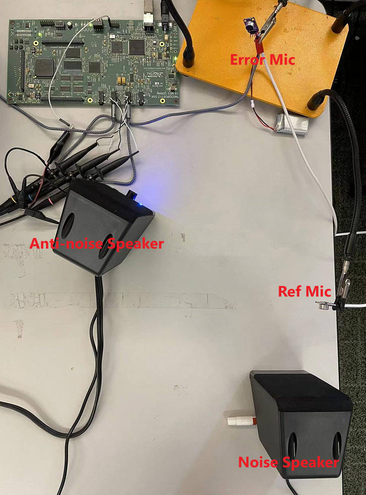

# DSK6713-SimpleANC
A simple active noise control realization on the Spectrum Digital C6713 DSP Starter Kit.

# Software Version
Since the DSK6713 is a very old type of DSP board, the latest CCS version which supports this board is 8.3.1. Also, you need to install the C6000 CSL Library which is available from [TI: SPRC090](https://www.ti.com/tool/SPRC090), and the [DSK6713 library](https://spinlab.wpi.edu/courses/ece4703/lib/DSK6713.zip).

# Creating the Project
## Parameters for new project of the DSK6713:
	- Target: Unclassified Device - DSK6713
	- Connection: Spectrum Digital DSL-EVM-eZdsp onboard USB Emulator
	- Project name: "Your Project"
	- Compiler version" TI v7.4.24 (you need to install this version in App Center)
	- Tool-chain: leave as default
	- Project templates and examples: Empty Project (with main.c).

## Add Files:
	- "installation path for C6xCSL"\C6xCSL\lib_3x
		- csl6713.lib
	- "installation path for DSK6713 library"\DSK6713\c6000\dsk6713
		- \include: dsk6713.h, dsk6713_aic23.h, dsk6713_dip.h, dsk6713_flash.h, dsk6713_led.h
		- \lib: dsk6713bsl.lib

## Build Settings:
	- CCS Build
		- C6000 Compiler
			- Include Options:
				- Add dir: "C:\Program Files\C6xCSL\lib_3x", "C:\Program Files\C6xCSL\include".
			- Advanced Options\Predefined Symbols
				- Add "CHIP_6713"

		- C6000 Linker
			- Command-line pattern: add "--diag_suppress=16002" to disable version dismatch warning.

## Hardware Connection:
	- Line In:
		- Left channel: error microphone
		- Right channel: reference microphone for the noise
	- Lint Out:
		- Left channel: anti noise signal
